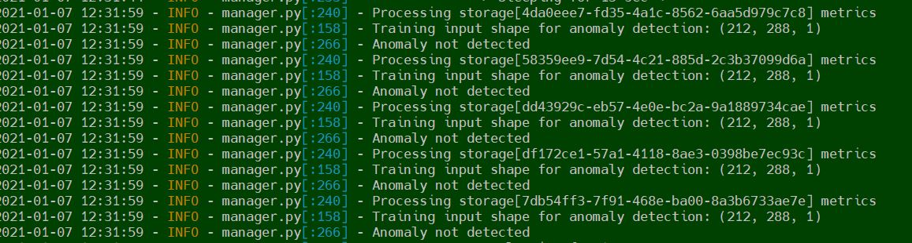

#Delfin-Kafka-AI PoC

-------

### Introduction
This provides basic PoC to illustrate Delfin-Kafka-AI integration where user can do analytics on metrics published by delfin.
The example connects metric published by Delfin on Kafka with basic anomaly detection system.
Anomaly detection module checks for spikes(anomaly) in collected metrics.

### Architecture

````
 ---------            ---------            ------------------
| Delfin  | ------>  |  Kafka  |  ----->  | Anomaly Detection |
 ---------            ---------            -------------------
````

- Delfin publish metric data on kafka (Default topic: delfin-kafka)
- Anomaly detection module subscribe for the topic and store the metric data in dictionary
- Anomaly detections runs on stored data in dictionary

### Steps:
- Setup Delfin and Kafka with [setup document](https://github.com/sodafoundation/examples/blob/master/DelfinPerformance/README.md)
- git clone https://github.com/sodafoundation/examples.git
- cd examples/DelfinAnomalyDetection
- Install dependencies with requirements.txt ```pip install -r requirements.txt```
- export PYTHONPATH=`pwd`
- python3 cmds/parser.py --config-file etc/anomaly_detection.conf

## Summary

-----

### Conclusion
- POC successfully shows Delfin-Kak=fka-AI integration
- It provides design PoC that user can do analytics by Delfin-Kafka integration
- PoC dumps detected anomaly in log
- Anomaly scenario:
  
  
- Normal scenario:
  
  
### Open Issues

- Currently only "read_bandwidth" considered
- (TODO) Online model training is not implemented 
- First 1000 (default: DATA_ENTRIES_COUNT=1000) samples are considered 
  for model training. Further incoming samples from Kafka are used for prediction.
