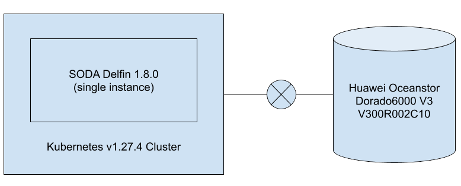

# SODA Delfin Project Integration in Toyota Motor Corporation Internal Lab

**Project :** Delfin - The SODA Infrastructure Manager Project ([https://github.com/sodafoundation/delfin](https://github.com/sodafoundation/delfin))

**User :** TOYOTA MOTOR CORPORATION

**Use case :** To experience the storage monitoring capability of Delfin

**Description :**
- Their setup have Kubernetes cluster setup along with several deployed applications
- Huawei Oceanstor storage is attached to the cluster
- SODA Delfin is deployed on this cluster in a single replica mode
- Ocenstor device is registered with delfin
- Below key scenarios are under test on the setup
  - Retrieval of storage information
  - Retrieval of storage controller information
  - Retrieval of storage pool information
  - Retrieval of disk information of the storage
  - Retrieval of volume information of the storage
  - Retrieval of port/controller information of the storage
  - Retrieval of alert information of the storage
  - Retrieval of performance metrics information of the storage

## Deployment View

## Test Status
|Feature|Function|Status|
|--|--|--|
|Storage Information|Retrieval|Completed|
||Registration|Completed|
||Deletion|Completed|
|Controller Information|Retrieval|Completed|
|Storage Pool Information|Retrieval|Completed|
|Disk Information|Retrieval|Completed|
|Port Information|Retrieval|Pending with Error|
|Alert/SNMP-config Information|Retrieval|Completed|
||Registration|Completed|
||Deletion|Completed|
|Performance Information|Retrieval|Pending with Error|

